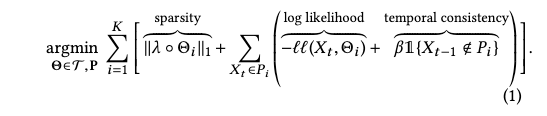
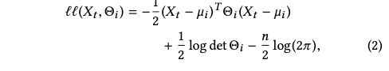
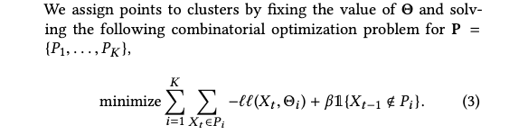
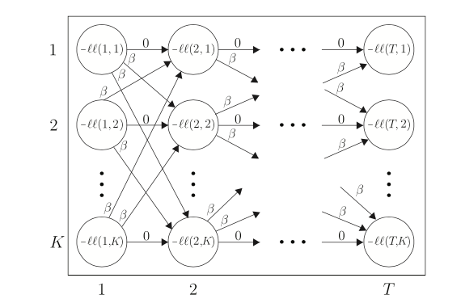
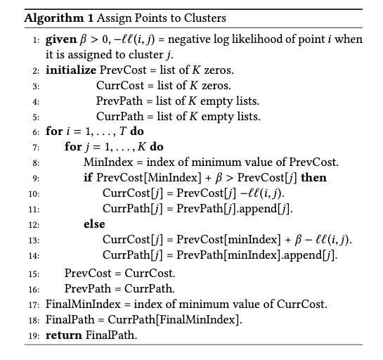
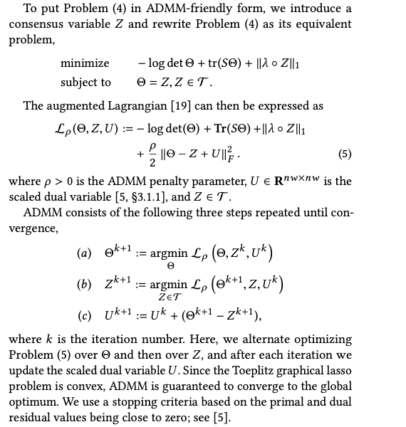
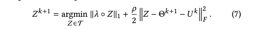
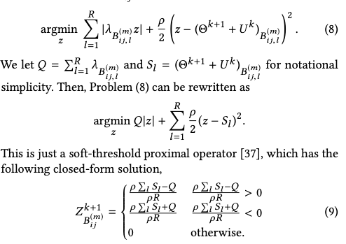

### TICC

Toeplitz Inverse Covariance-Based Clustering 

中心思想：利用偏相关系数矩阵（协方差矩阵的逆），来确定每个cluster的特征，这个偏相关系数矩阵可以用来构建多层的MRF，其中的非零值定义了层层之间以及层内的关联关系，这是为了模型的可解释性。

模型中聚类的数量K并不是动态生成，使用经验分类或者BIC算法获得。

全局优化的公式：

这里的log likelihood为：

论文将这个优化问题分为2个优化步骤。

第一个步骤为把点分到各个类别中：

这里使用DP算法，类似于Viterbi path：

第二步为根据上一步骤的分布率，来优化偏相关矩阵的参数，使得似然概率最优。

具体的优化项为：

这个子问题被称为Toeplitz Graphical Lasso

论文中使用ADMM方法来进行可行的参数梯度确定。

原问题被转换为ADMM的方式：

这是一种scaled之后参数简化的形式，将整个优化问题分成了3步优化的迭代。theta步的迭代为：

Z步的迭代为：

这一步可以为Z中的每一项进行操作，还能够进行化简：

而U的迭代非常直接。